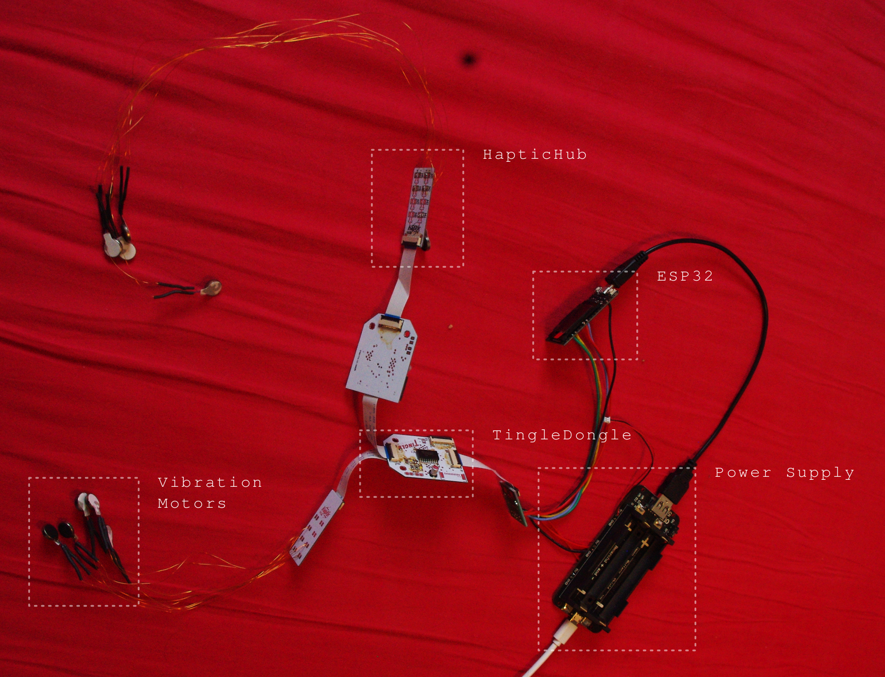

# TingleDongle Server

A webserver for the ESP32, that allows to control vibration motors attached to chained shift registers aka TingleDongles:

## Usage
 Step                                                         | QR Code                                                      
 ------------------------------------------------------------ | ------------------------------------------------------------ 
 Log into the TingleDongle Servers WLAN called `Tingledongle` using the password `tingletingle`. You can use the QR code. |  
 You will find the GUI at http://tingledongle.local or alternatively at http://192.168.4.1. Here you can set the motor power and toggle individual motors as well as all motors together. |  
 You can make the ESP32 log into your home WLAN by clicking "Changle WLAN". This way you can access the internet and control the vibration motors at the same time. |  

## Pin Layout
SPI is used to pipe data to the shift registers.
PWN on a separate enable line controls the motor power for all motors together.

Function | Number
---------|-------:
Enable   | 17
MOSI     | 23
Clock  	 | 19
Chip Select | 16

